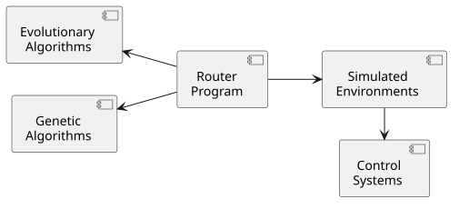

# Project Overview #

The NPC Maker is a modular framework for artificial-life experiments.
Each component is isolated in its own computer process with a well defined
interface for interacting with the larger system. Components communicate
over their standard input, output, and error channels. Messages are encoded
in UTF-8 unless otherwise stated. Structured data is transmitted in JSON.
This design is easy to implement and debug.

The NPC Maker API is implemented in both python and rust. Components
implemented in different languages communicate via the NPC Maker interfaces.

## System Organization ##

Artificial-life experiments are split into 5 component types:
* **Router Programs** initialize and communicate between other components.
* **Simulated Environments** are self-contained worlds populated by AI agents.
* **Control Systems** are the brains of the agents.
* **Evolutionary Algorithms** decide which agents to reproduce.
* **Genetic Algorithms** reproduce the parameters for control systems.

## Interface Specifications ##

The interfaces are documented in these chapters:
* [Simulated Environments](/docs/environments.md)
* [Control Systems](/docs/controllers.md)
* [Individual Files](/docs/individuals.md)
* [Genetic Algorithms](/docs/genetics.md)
* [Evolutionary Algorithms](/docs/evolution.md)

### Standard Error Channel ###

The standard error channel is reserved for unformatted diagnostic and error messages.
By default processes inherit `stderr` from their parent process, which should in turn forward its standard error to the user.

In the event that any of the three standard I/O channels close or emit an error,
then all parties should assume that the other party has died and act accordingly.
Close both the standard input and output channels to signal the termination of
the program and to prevent deadlock.

## Directory Structure ##

* `/docs/`
* `/python/`
* `/rust/`
* `/examples/env/`
* `/examples/ctrl/`
* `/examples/evo/`
* `/examples/gen/`
