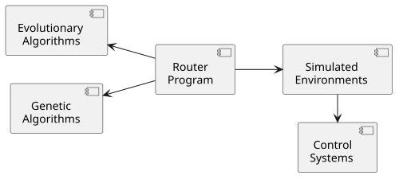

# Project Overview #

## System Organization ##

Artificial-life experiments are split into 5 component types:
* **Server Programs** initialize and communicate between other components.
* **Simulated Environments** are self-contained worlds populated by AI agents.
* **Control Systems** are the brains of the agents.
* **Evolutionary Algorithms** decide which agents to reproduce.
* **Genetic Algorithms** reproduce the parameters for control systems.

Each of these component executes in its own computer process.
Some components create and manage other components,
and they may contain multiple instances of the contained component.
In the diagram above: arrows indicate parent-child relationships,
which are also one-to-many relationships.

## Directory Structure ##

| Folder      | Description |
| :---------- | :---------- |
| `docs/`     | Documentation and Interface Specifications
| `python/`   | Python API for using the NPC Maker interfaces
| `rust/`     | Rust API for using the NPC Maker interfaces
| `programs/` | Executable programs bundled with the NPC Maker
| `programs/npc-client/`   | Run environments over the internet |
| `programs/npc-evo/`      | Suite of evolutionary algorithms |
| `programs/npc-player/`   | Population inspection utility |
| `programs/npc-maker/`    | Main program for orchestrating experiments |
| `programs/npc-maker-py/` | Simplified python version of npc-maker program |
| `tests/`    | Integration and Regression tests
| `examples/` |  |
| `examples/ctrl/` | Example controllers |
| `examples/gen/`  | Example genetic algorithms |
| `examples/env/`  | Example environments |
