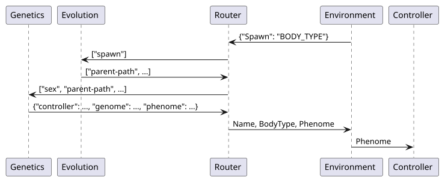
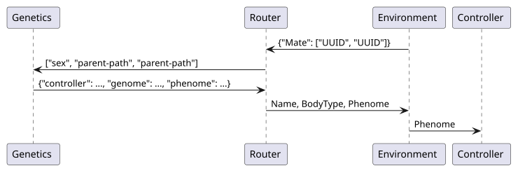
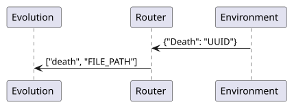
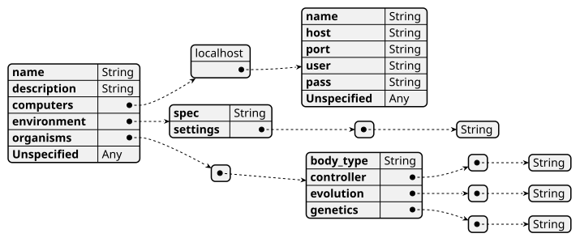

# Router Program #

The router program orchestrates all other components of the NPC Maker.

## Requirements ##

1) The router program is the first program to execute, and performs all
system-wide initialization tasks.

2) The router instantiates all: environments, evolutionary algorithms, and genetic
algorithms.

3) The router program keeps a record of every living individual. Records are
created when individuals are sent to the environment, and records are removed
upon death. The environment API implementation updates these records as the
environment sends information using "Telemetry" and "Score" messages.

4) The router program passes messages between environments, evolutionary algorithms,
and genetic algorithms. These messages are "Spawn", "Mate", and "Death".

## Sequence Diagrams ##

### Spawn Sequence ###

This sequence diagram shows the message and file transmissions that occur when
the environment creates a new individual without specifying parents.

### Mate Sequence ###

This sequence diagram shows the message and file transmissions that occur when
living individuals procreate in an environment.

### Death Sequence ###

This sequence diagram shows the message and file transmissions that occur when
an individual dies.

### Individual Life Cycle ###

This sequence diagram shows the life cycle of an individual as it is created,
simulated, and dies.

## Experiment Specification ##

To facilitate reproducible experimentation, the parameters for running the NPC
Maker are stored in "**Experiment Files**", which have the "**.exp**" file
extension. Experiment files are encoded in UTF-8 and contain a single JSON
Object with the following attributes. Leading and trailing whitespace is
permitted.

| Attribute | JSON Type | Default Value | Description |
| :-------- | :-------: | :------------ | :---------- |
| `"name"`        | String | Required | Name of the experiment, should be universally unique |
| `"description"` | String | `""`     | User facing documentation message |
| `"computers"`   | List of Computers | `["localhost"]` |  |
| `"environment"` | Environment | Required | Command line invocation for environment program |
| `"organisms"`   | List of Organisms | Required |  |
| Unspecified     | Any |  | This object may include additional attributes |

### Computer Objects ###

The "**computers**" attribute is a dictionary of named Computer objects, which
specify available computational resources. The dictionary keys are String
names to identify each computer. Computer objects have the following fields,
and may contain additional fields.

| Attribute | JSON Type | Default Value | Description |
| :-------- | :-------: | :------------ | :---------- |
| `"host"`  | String | Required |  |
| `"port"`  | Number | Required |  |
| `"user"`  | String | Required |  |
| `"pass"`  | String |  |  |
| `"key"`  | String |  |  |
| Unspecified | Any |  | This object may include additional attributes |

todo...

### Environment Objects ###

The "**environment**" attribute is a JSON Object with the following structure:

| Attribute | JSON Type | Default Value | Description |
| :-------- | :-------: | :------------ | :---------- |
| `"spec"`  | String | Required | File path to the environment specification file (.env) |
| `"settings"` | List of Strings | `[]` | Settings for the environment program |
| Unspecified | Any |  | This object may include additional attributes |

### Organism Objects ###

The "**organisms**" attribute is an array of Organism objects, which attach a
control system, evolutionary algorithm, and genetic algorithm to each body
type. Every body type in the environment specification must have a
corresponding entry here. Extra entries are ignored.

| Attribute | JSON Type | Default Value | Description |
| :-------- | :-------: | :------------ | :---------- |
| `"body_type"`  | String | Required | Identifies a body-type from the environment specification |
| `"controller"` | Array of Strings | Required | Command line invocation for controller program |
| `"evolution"`  | Array of Strings | `[]` | Command line invocation for evolution program |
| `"genetics"`   | Array of Strings | Required | Command line invocation for genetic program |

### JSON Schema for .exp Files ###

